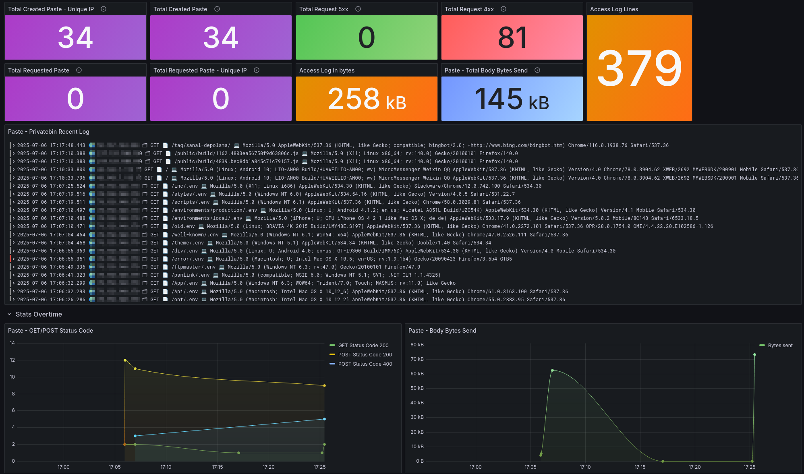

# Nginx Monitoring
### Nginx Dashboards


### Source

- [VoidQuark Grafana Dashboards](https://github.com/voidquark/grafana-dashboards)
- [Grafana Dashboard: PrivateBin Access Log](https://grafana.com/grafana/dashboards/19507-privatebin-access-log/)
- [Grafana Dashboard: SSH Logs](https://grafana.com/grafana/dashboards/17514-ssh-logs/)

NGINX erişim loglarını JSON formatında Promtail üzerinden Loki'ye gönderip, Grafana ile görselleştirmeyi sağlayan izleme altyapısı.

- promtail-config.yaml
```bash

server:
  http_listen_port: 9080
  grpc_listen_port: 0

positions:
  filename: /tmp/positions.yaml

clients:
  - url: http://loki:3100/loki/api/v1/push

scrape_configs:
  # Nginx access.log
  - job_name: nginx
    static_configs:
      - targets:
          - localhost
        labels:
          job: nginx
          __path__: /var/log/nginx/access.log
    relabel_configs:
      - source_labels: [__path__]
        regex: .*/wp-content/.*|.*/wp-admin/.*|.*/api/.*|.*/scripts/.*|.*/public/.*|.*/config/.*|.*/wp-json.*|.*/wp-includes/.*|.*/cgi-bin/.*|.*\?ao_speedup_cachebuster.*
        action: drop

  # auth.log
  - job_name: authlog
    static_configs:
      - targets:
          - localhost
        labels:
          job: authlog
          __path__: /var/log/auth.log


```

- loki-config.yaml
```bash
auth_enabled: false

server:
  http_listen_port: 3100
  grpc_listen_port: 9095

common:
  path_prefix: /loki
  storage:
    filesystem:
      chunks_directory: /loki/chunks
      rules_directory: /loki/rules
  replication_factor: 1
  ring:
    kvstore:
      store: inmemory

schema_config:
  configs:
    - from: 2020-10-24
      store: boltdb-shipper
      object_store: filesystem
      schema: v11
      index:
        prefix: index_
        period: 24h

ruler:
  alertmanager_url: http://localhost:9093

limits_config:
  ingestion_rate_mb: 50
  ingestion_burst_size_mb: 100
  max_streams_per_user: 100000
  max_entries_limit_per_query: 10000
  per_stream_rate_limit: 10MB
  per_stream_rate_limit_burst: 20MB

```

- nginx.conf
```bash
log_format json_combined escape=json
  '{'
    '"time_local":"$time_local",'
    '"remote_addr":"$remote_addr",'
    '"status":"$status",'
    '"msec":"$msec",'
    '"bytes_sent":"$bytes_sent",'
    '"body_bytes_sent":"$body_bytes_sent",'
    '"request":"$request",'
    '"request_time":"$request_time",'
    '"request_method":"$request_method",'
    '"request_uri":"$request_uri",'
    '"request_length":"$request_length",'
    '"host":"$http_host",'
    '"referer":"$http_referer",'
    '"user_agent":"$http_user_agent",'
    '"x_forwarded_for":"$http_x_forwarded_for",'
    '"x_forwarded_proto":"$x_forwarded_proto",'
    '"connection":"$connection",'
    '"accept_encoding":"$http_accept_encoding",'
    '"accept_language":"$http_accept_language",'
    '"accept":"$http_accept",'
    '"cf_ray":"$http_cf_ray",'
    '"cf_connecting_ip":"$http_cf_connecting_ip",'
    '"cf_ipcountry":"$http_cf_ipcountry",'
    '"sec_fetch_site":"$http_sec_fetch_site",'
    '"sec_fetch_mode":"$http_sec_fetch_mode",'
    '"sec_fetch_dest":"$http_sec_fetch_dest"'
  '}';

access_log /var/log/nginx/access.log json_combined;
error_log /var/log/nginx/error.log;

```

- Loki Quary
```bash
{job="nginx"} | json 
| remote_addr!~"^172\\.20\\..*" 
and remote_addr != "" 
and request_uri!~"^/api/.*" 
and request_uri!~"(?i)(\\.env|\\.env\\.local|\\.env\\.production|/old\\.env|/scripts$|/scripts/.*|/error/\\.env|/wp-content/uploads/.*|/public/img/icons/.*|/public/app/plugins/.*|/config/.*|/getcfg\\.php|\\?phpinfo.*|/app_dev\\.php.*|/public/fonts/.*|/public/build/.*|/wp-includes/.*|/wp-admin/.*|/wp-content/plugins/.*|/wp-json.*|/\\?customize.*|/wp-content/themes/.*|/cgi-bin/.*|/\\?ao_speedup_cachebuster.*|/favicon.ico|/d/.*|/avatar/.*|/public/.*|/connections/.*|/wp-content/.*)" 
| line_format "🌍 {{.remote_addr}} 🗂 {{.request_method}} 📄 {{.request_uri}} 💻 {{.user_agent}}"

```
